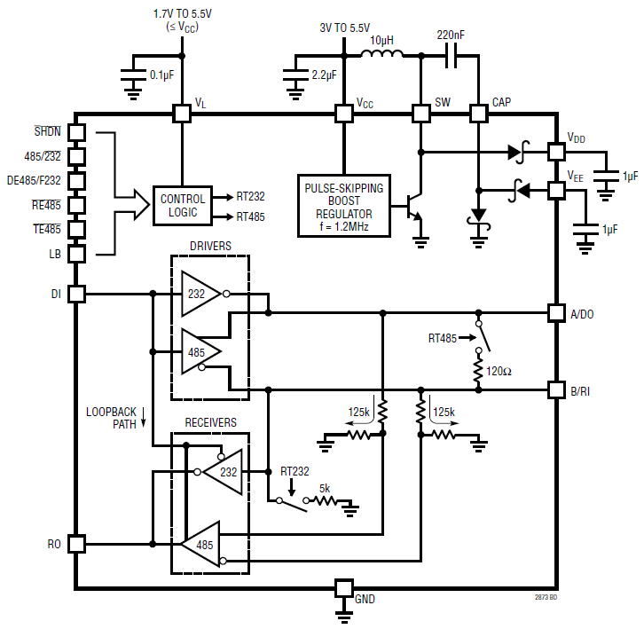
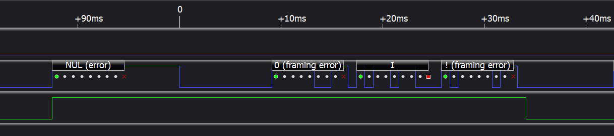
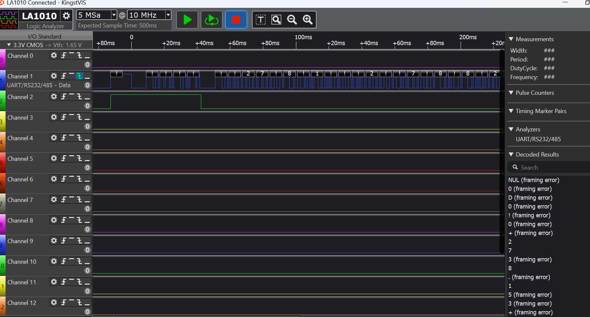

# SDI-12 ESP-IDF Component (Beta)

[![K0I05](https://img.shields.io/badge/K0I05-a9a9a9?logo=data:image/svg%2bxml;base64,PHN2ZyB4bWxucz0iaHR0cDovL3d3dy53My5vcmcvMjAwMC9zdmciIHdpZHRoPSIxODgiIGhlaWdodD0iMTg3Ij48cGF0aCBmaWxsPSIjNDU0QjU0IiBkPSJNMTU1LjU1NSAyMS45M2MxOS4yNzMgMTUuOTggMjkuNDcyIDM5LjM0NSAzMi4xNjggNjMuNzg5IDEuOTM3IDIyLjkxOC00LjU1MyA0Ni42Ni0xOC44NDggNjQuNzgxQTUwOS40NzggNTA5LjQ3OCAwIDAgMSAxNjUgMTU1bC0xLjQ4NCAxLjg4M2MtMTMuMTk2IDE2LjUzMS0zNS41NTUgMjcuMjE1LTU2LjMzOSAyOS45MDItMjguMzEyIDIuOC01Mi4yNTUtNC43MzctNzQuNzMyLTIxLjcxNUMxMy4xNzIgMTQ5LjA5IDIuOTczIDEyNS43MjUuMjc3IDEwMS4yODEtMS42NiA3OC4zNjMgNC44MyA1NC42MjEgMTkuMTI1IDM2LjVBNTA5LjQ3OCA1MDkuNDc4IDAgMCAxIDIzIDMybDEuNDg0LTEuODgzQzM3LjY4IDEzLjU4NiA2MC4wNCAyLjkwMiA4MC44MjMuMjE1YzI4LjMxMi0yLjggNTIuMjU1IDQuNzM3IDc0LjczMiAyMS43MTVaIi8+PHBhdGggZmlsbD0iI0ZERkRGRCIgZD0iTTExOS44NjcgNDUuMjdDMTI4LjkzMiA1Mi4yNiAxMzMuODIgNjMgMTM2IDc0Yy42MyA0Ljk3Mi44NDIgOS45NTMuOTUzIDE0Ljk2LjA0NCAxLjkxMS4xMjIgMy44MjIuMjAzIDUuNzMxLjM0IDEyLjIxLjM0IDEyLjIxLTMuMTU2IDE3LjMwOWE5NS42MDQgOTUuNjA0IDAgMCAxLTQuMTg4IDMuNjI1Yy00LjUgMy43MTctNi45NzQgNy42ODgtOS43MTcgMTIuODAzQzEwNi45NCAxNTIuNzkyIDEwNi45NCAxNTIuNzkyIDk3IDE1N2MtMy40MjMuNTkyLTUuODAxLjY4NS04Ljg3OS0xLjA3NC05LjgyNi03Ljg4LTE2LjAzNi0xOS41OS0yMS44NTgtMzAuNTEyLTIuNTM0LTQuNTc1LTUuMDA2LTcuMjEtOS40NjYtMTAuMDItMy43MTQtMi44ODItNS40NS02Ljk4Ni02Ljc5Ny0xMS4zOTQtLjU1LTQuODg5LS41NjEtOS4zMTYgMS0xNCAuMDkzLTEuNzYzLjE4Mi0zLjUyNy4yMzktNS4yOTIuNDkxLTEzLjg4NCAzLjg2Ni0yNy4wNTcgMTQuMTU2LTM3LjAyOCAxNy4yMTgtMTQuMzM2IDM1Ljg1OC0xNS4wNjYgNTQuNDcyLTIuNDFaIi8+PHBhdGggZmlsbD0iI0M2RDVFMCIgZD0iTTEwOSAzOWMxMS43MDMgNS4yNTUgMTkuMjA2IDEzLjE4NiAyNC4yOTMgMjUuMDA0IDIuODU3IDguMjQgMy40NyAxNi4zMTYgMy42NiAyNC45NTYuMDQ0IDEuOTExLjEyMiAzLjgyMi4yMDMgNS43MzEuMzQgMTIuMjEuMzQgMTIuMjEtMy4xNTYgMTcuMzA5YTk1LjYwNCA5NS42MDQgMCAwIDEtNC4xODggMy42MjVjLTQuNSAzLjcxNy02Ljk3NCA3LjY4OC05LjcxNyAxMi44MDNDMTA2LjgwNCAxNTMuMDQxIDEwNi44MDQgMTUzLjA0MSA5NyAxNTdjLTIuMzMyLjA3OC00LjY2OC4wOS03IDBsMi4xMjUtMS44NzVjNS40My01LjQ0NSA4Ljc0NC0xMi41NzcgMTEuNzU0LTE5LjU1OWEzNDkuNzc1IDM0OS43NzUgMCAwIDEgNC40OTYtOS44NzlsMS42NDgtMy41NWMyLjI0LTMuNTU1IDQuNDEtNC45OTYgNy45NzctNy4xMzcgMi4zMjMtMi42MSAyLjMyMy0yLjYxIDQtNWwtMyAxYy0yLjY4LjE0OC01LjMxOS4yMy04IC4yNWwtMi4xOTUuMDYzYy01LjI4Ny4wMzktNS4yODcuMDM5LTcuNzc4LTEuNjUzLTEuNjY2LTIuNjkyLTEuNDUzLTQuNTYtMS4wMjctNy42NiAyLjM5NS00LjM2MiA0LjkyNC04LjA0IDkuODI4LTkuNTcgMi4zNjQtLjQ2OCA0LjUxNC0uNTI4IDYuOTIyLS40OTNsMi40MjIuMDI4TDEyMSA5MmwtMS0yYTkyLjc1OCA5Mi43NTggMCAwIDEtLjM2LTQuNTg2QzExOC42IDY5LjYzMiAxMTYuNTE3IDU2LjA5NCAxMDQgNDVjLTUuOTA0LTQuNjY0LTExLjYtNi4wODgtMTktNyA3LjU5NC00LjI2NCAxNi4yMjMtMS44MSAyNCAxWiIvPjxwYXRoIGZpbGw9IiM0OTUwNTgiIGQ9Ik03NyA5MmM0LjYxMyAxLjY3MSA3LjI2IDMuOTQ1IDEwLjA2MyA3LjkzOCAxLjA3OCAzLjUyMy45NzYgNS41NDYtLjA2MyA5LjA2Mi0yLjk4NCAyLjk4NC02LjI1NiAyLjM2OC0xMC4yNSAyLjM3NWwtMi4yNzcuMDc0Yy01LjI5OC4wMjgtOC4yNTQtLjk4My0xMi40NzMtNC40NDktMi44MjYtMy41OTctMi40MTYtNy42MzQtMi0xMiA0LjUwMi00LjcyOCAxMC45OS0zLjc2IDE3LTNaIi8+PHBhdGggZmlsbD0iIzQ4NEY1NyIgZD0ibTExOCA5MS43NSAzLjEyNS0uMDc4YzMuMjU0LjM3MSA0LjU5NyAxLjAwMiA2Ljg3NSAzLjMyOC42MzkgNC4yMzEuMjkgNi40NDItMS42ODggMTAuMjUtMy40MjggNC4wNzgtNS44MjcgNS41OTgtMTEuMTk1IDYuMTQ4LTEuNDE0LjAwOC0yLjgyOCAwLTQuMjQyLS4wMjNsLTIuMTY4LjAzNWMtMi45OTgtLjAxNy01LjE1Ny0uMDMzLTcuNjcyLTEuNzU4LTEuNjgxLTIuNjg0LTEuNDYtNC41NTItMS4wMzUtNy42NTIgMi4zNzUtNC4zMjUgNC44OTQtOC4wMDkgOS43NS05LjU1OSAyLjc3Ny0uNTQ0IDUuNDItLjY0OSA4LjI1LS42OTFaIi8+PHBhdGggZmlsbD0iIzUyNTg2MCIgZD0iTTg2IDEzNGgxNmwxIDRjLTIgMi0yIDItNS4xODggMi4yNjZMOTQgMTQwLjI1bC0zLjgxMy4wMTZDODcgMTQwIDg3IDE0MCA4NSAxMzhsMS00WiIvPjwvc3ZnPg==)](https://github.com/K0I05)
[](/LICENSE)
[](https://visualstudio.microsoft.com)
[![Build with PlatformIO](https://img.shields.io/badge/build%20with-PlatformIO-orange?logo=data%3Aimage%2Fsvg%2Bxml%3Bbase64%2CPHN2ZyB3aWR0aD0iMjUwMCIgaGVpZ2h0PSIyNTAwIiB2aWV3Qm94PSIwIDAgMjU2IDI1NiIgeG1sbnM9Imh0dHA6Ly93d3cudzMub3JnLzIwMDAvc3ZnIiBwcmVzZXJ2ZUFzcGVjdFJhdGlvPSJ4TWlkWU1pZCI+PHBhdGggZD0iTTEyOCAwQzkzLjgxIDAgNjEuNjY2IDEzLjMxNCAzNy40OSAzNy40OSAxMy4zMTQgNjEuNjY2IDAgOTMuODEgMCAxMjhjMCAzNC4xOSAxMy4zMTQgNjYuMzM0IDM3LjQ5IDkwLjUxQzYxLjY2NiAyNDIuNjg2IDkzLjgxIDI1NiAxMjggMjU2YzM0LjE5IDAgNjYuMzM0LTEzLjMxNCA5MC41MS0zNy40OUMyNDIuNjg2IDE5NC4zMzQgMjU2IDE2Mi4xOSAyNTYgMTI4YzAtMzQuMTktMTMuMzE0LTY2LjMzNC0zNy40OS05MC41MUMxOTQuMzM0IDEzLjMxNCAxNjIuMTkgMCAxMjggMCIgZmlsbD0iI0ZGN0YwMCIvPjxwYXRoIGQ9Ik0yNDkuMzg2IDEyOGMwIDY3LjA0LTU0LjM0NyAxMjEuMzg2LTEyMS4zODYgMTIxLjM4NkM2MC45NiAyNDkuMzg2IDYuNjEzIDE5NS4wNCA2LjYxMyAxMjggNi42MTMgNjAuOTYgNjAuOTYgNi42MTQgMTI4IDYuNjE0YzY3LjA0IDAgMTIxLjM4NiA1NC4zNDYgMTIxLjM4NiAxMjEuMzg2IiBmaWxsPSIjRkZGIi8+PHBhdGggZD0iTTE2MC44NjkgNzQuMDYybDUuMTQ1LTE4LjUzN2M1LjI2NC0uNDcgOS4zOTItNC44ODYgOS4zOTItMTAuMjczIDAtNS43LTQuNjItMTAuMzItMTAuMzItMTAuMzJzLTEwLjMyIDQuNjItMTAuMzIgMTAuMzJjMCAzLjc1NSAyLjAxMyA3LjAzIDUuMDEgOC44MzdsLTUuMDUgMTguMTk1Yy0xNC40MzctMy42Ny0yNi42MjUtMy4zOS0yNi42MjUtMy4zOWwtMi4yNTggMS4wMXYxNDAuODcybDIuMjU4Ljc1M2MxMy42MTQgMCA3My4xNzctNDEuMTMzIDczLjMyMy04NS4yNyAwLTMxLjYyNC0yMS4wMjMtNDUuODI1LTQwLjU1NS01Mi4xOTd6TTE0Ni41MyAxNjQuOGMtMTEuNjE3LTE4LjU1Ny02LjcwNi02MS43NTEgMjMuNjQzLTY3LjkyNSA4LjMyLTEuMzMzIDE4LjUwOSA0LjEzNCAyMS41MSAxNi4yNzkgNy41ODIgMjUuNzY2LTM3LjAxNSA2MS44NDUtNDUuMTUzIDUxLjY0NnptMTguMjE2LTM5Ljc1MmE5LjM5OSA5LjM5OSAwIDAgMC05LjM5OSA5LjM5OSA5LjM5OSA5LjM5OSAwIDAgMCA5LjQgOS4zOTkgOS4zOTkgOS4zOTkgMCAwIDAgOS4zOTgtOS40IDkuMzk5IDkuMzk5IDAgMCAwLTkuMzk5LTkuMzk4em0yLjgxIDguNjcyYTIuMzc0IDIuMzc0IDAgMSAxIDAtNC43NDkgMi4zNzQgMi4zNzQgMCAwIDEgMCA0Ljc0OXoiIGZpbGw9IiNFNTcyMDAiLz48cGF0aCBkPSJNMTAxLjM3MSA3Mi43MDlsLTUuMDIzLTE4LjkwMWMyLjg3NC0xLjgzMiA0Ljc4Ni01LjA0IDQuNzg2LTguNzAxIDAtNS43LTQuNjItMTAuMzItMTAuMzItMTAuMzItNS42OTkgMC0xMC4zMTkgNC42Mi0xMC4zMTkgMTAuMzIgMCA1LjY4MiA0LjU5MiAxMC4yODkgMTAuMjY3IDEwLjMxN0w5NS44IDc0LjM3OGMtMTkuNjA5IDYuNTEtNDAuODg1IDIwLjc0Mi00MC44ODUgNTEuODguNDM2IDQ1LjAxIDU5LjU3MiA4NS4yNjcgNzMuMTg2IDg1LjI2N1Y2OC44OTJzLTEyLjI1Mi0uMDYyLTI2LjcyOSAzLjgxN3ptMTAuMzk1IDkyLjA5Yy04LjEzOCAxMC4yLTUyLjczNS0yNS44OC00NS4xNTQtNTEuNjQ1IDMuMDAyLTEyLjE0NSAxMy4xOS0xNy42MTIgMjEuNTExLTE2LjI4IDMwLjM1IDYuMTc1IDM1LjI2IDQ5LjM2OSAyMy42NDMgNjcuOTI2em0tMTguODItMzkuNDZhOS4zOTkgOS4zOTkgMCAwIDAtOS4zOTkgOS4zOTggOS4zOTkgOS4zOTkgMCAwIDAgOS40IDkuNCA5LjM5OSA5LjM5OSAwIDAgMCA5LjM5OC05LjQgOS4zOTkgOS4zOTkgMCAwIDAtOS4zOTktOS4zOTl6bS0yLjgxIDguNjcxYTIuMzc0IDIuMzc0IDAgMSAxIDAtNC43NDggMi4zNzQgMi4zNzQgMCAwIDEgMCA0Ljc0OHoiIGZpbGw9IiNGRjdGMDAiLz48L3N2Zz4=)](https://platformio.org/)
[](https://github.com/K0I05/ESP32-S3_SDI12_20241231/actions/workflows/pio_build.yml)

## A Serial-Digital Interface Standard for Microprocessor-Based Sensors

If you have a background in instrumentation and environmental monitoring, then you most likely came accross SDI-12 throughout your journey.  SDI-12 is a common digital interface available for smart instruments i.e. microprocessor-based.  SDI-12 is a flexible, has a low hardware implementation cost, and is a low powered communication protocol that permits interfacing of multiple microprocessor-based sensors to a single data-recorder through one multiconductor cable.  The interfacing circuitry leverages common commercially available electronic components with a bus that is comprised of three conductors.

## SDI-12 Electrical Interface

The SDI-12 electrical interface consist of a bus to power and transmit serial data between data-recorders and sensors.  In this context, the bus is a multiconductor cable that connects multiple SDI-12 devices, comprised of three conductors for power (12VDC), grounding, and serial data.  The SDI-12 bus can handle up to 10 devices simultaneously connected to the bus with a limit of 60 meters of cable length between each sensor.  Longer cable lengths are possible if there are fewere devices on the SDI-12 bus.

## ESP32-S3 SDI-12 Electrical Interface

There are basic SDI-12 circuit examples provided in the published SDI-12 protocol standard.  However, for greater flexibility and versatility, the LTC2873 single-bus RS-485/RS-232 multiprotocol transceiver with switchable termination by Analog Devices was utilized and evaluated with the Analog Devices DC2364A evaluation board.  The LTC2873 is user configurable through GPIO pins for hardware interfacing with the microcontroller and can be programmed for RS-485 with full or half-duplex, RS-422, RS-232, and SDI-12 communication protocols.  The LTC2873 supports tri-state conditions through the receiver enable (RE) and driver enable (DE) pins making it suitable for SDI-12 communication protocol.



When an SDI-12 command is issued, the microcontroller toggles the RE and DE pins to a logic high and the TX pin to a logic low for the start of the transmission break sequence. After the break sequence period (~12.5ms), the microcontroller toggles the TX pin to a logic high for the mark sequence period (~8.3ms), the SDI-12 command characters are transmitted to the device, and then the microcontroller toggles the RE and DE pins to a logic low while it waits to receive a response from the device.  There is a total of 7 GPIO pins needed for microcontroller and DC2364A evaluation board hardware interacing which are defined below.

```c
#define SDI12_MASTER_TXD_IO_NUM                     (GPIO_NUM_17) /*!< uart ttl transmit */
#define SDI12_MASTER_RXD_IO_NUM                     (GPIO_NUM_16) /*!< uart ttl receive */
#define SDI12_MASTER_RTS_IO_NUM                     (UART_PIN_NO_CHANGE)
#define SDI12_MASTER_CTS_IO_NUM                     (UART_PIN_NO_CHANGE)
#define SDI12_MASTER_IO_IO_NUM                      (GPIO_NUM_4)  /*!< logic supply ref voltage (dev board logic supply) */
#define SDI12_MASTER_DE_IO_NUM                      (GPIO_NUM_13) /*!< in rs485 mode a logic low disables rs-485 driver and high enables driver, in rs 232 a logic high enables fast mode (1Mbps) and low enables slow mode (250kbps) */
#define SDI12_MASTER_RE_IO_NUM                      (GPIO_NUM_18) /*!< logic high disables the rs485 receiver and low enables the receiver */
#define SDI12_MASTER_TE_IO_NUM                      (GPIO_NUM_19) /*!< logic low for 120-ohm termination or high for unterminated */
#define SDI12_MASTER_MODE_IO_NUM                    (GPIO_NUM_21) /*!< logic low for rs-232 and high for rs-485 */
```

The microcontroller, ESP32-S3, is interfaced to the Analog Devices DC2364A evaluation board as outlined below.

```text
MCU GPIO Pin Definitions            DC2364A Pin Definitions
----------------------------------------------------------------
3.3VDC POWER                        3V
Ground                              G
SDI12_MASTER_TXD_IO_NUM             11 (TX)
SDI12_MASTER_RXD_IO_NUM             10 (RX)
SDI12_MASTER_IO_IO_NUM              IO (IO)
SDI12_MASTER_DE_IO_NUM              ~3 (DE)
SDI12_MASTER_RE_IO_NUM              4 (RE)
SDI12_MASTER_TE_IO_NUM              ~6 (TE)
SDI12_MASTER_MODE_IO_NUM            ~5 (MODE)
```

The DC2364A evaluation board was interfaced to the CR6 data-logger with the DC2364A's ground connected to `G` on the CR6 and `B/RI` of the DC2364A was connected to port `C3` on the CR6 for serial data.  The CR6, ESP32-S3, and Kingst LA1010 Logic Analizerand were connected t the laptop's USB ports for power and communication.



If you have a logic analyzer, be sure to inverse the signals when sniffing the serial lines, otherwise the information will look like garbage.  To interface the SDI-12 device, the B/RI terminal is used on the DC2364A evaluation board, and ensure that the SDI-12 device is properly grounded to the DC2364A evaluation board.  Otherwise, you may experience unexpected behaviour and erroneous results.



## SDI-12 Prototyping & Controls

A Campbell Scientific CR6 data-logger was programmed to simulate an SDI-12 sensor but I do have a multi-parameter SDI-12 meteorological sensor as a backup. For prototyping purposes, the CR6 is more than suitable to act as an SDI-12 control device, and programming implementation with the ESP32-S3 was troubleshooted with a Kingst LA1010 Logic Analizer. The ESP32-S3 board is interfaced to a breakout board with screw terminals for easy wiring to the Analog Devices DC2364A evaluation board.


The CR6 was programmed to output 6 parameters with a processing time of 4-seconds.  When the SDI-12 master executes an `aM!` command the CR6 will respond with a `a0104<CR><LF>`.  The SDI-12 master removes the `<CR><LF>` characters from command responses.  The CR6 program that was used is available in the documentation folder (SDI12-Sensor-Emulator.CR6) and can be viewed with any text editor.

## SDI-12 ESP-IDF Component Implementation

The ESP32 espressif IoT development framework (esp-idf) compatible component is a beta release with basic functionality.

Key features implemented to date include:

- **Ackowledge Active:** ackowledges if the SDI-12 device is active.
- **Send Identification:** retreives identification details from SDI-12 device.

```text
W (36905) SDI-12 [APP]: sdi-12 version:        1.4
W (36905) SDI-12 [APP]: vendor identification: Campbell
W (36905) SDI-12 [APP]: sensor model:          CR6  
W (36915) SDI-12 [APP]: sensor version:         01
W (36915) SDI-12 [APP]: sensor information:    4Std.14.01
```

- **Change Address:** changes the device's SDI-12 address.
- **Address Query:** checks if the SDI-12 device address being queried is on the SDI-12 bus.
- **Recorder:** issues a start measurement command (aM!) and retreives measurement values from the SDI-12 device.

```text
W (35775) SDI-12 [APP]: sdi-12 sensor response value: 3.335000
W (35775) SDI-12 [APP]: sdi-12 sensor response value: 23.649200
W (35775) SDI-12 [APP]: sdi-12 sensor response value: -2.680000
W (35785) SDI-12 [APP]: sdi-12 sensor response value: 23.649290
W (35795) SDI-12 [APP]: sdi-12 sensor response value: -2.680000
W (35795) SDI-12 [APP]: sdi-12 sensor response value: 23.649290
```

There is always room for improvement to optimize the code base and open to suggestions.  As an example, to free up the microcontroller's UART TX line, the code enables and disables the UART everytime a command is executed.  Is this an ideal approach or is there another way to handle this.

## References & Resources

Additional information is available here:

- <https://www.sdi-12.org/>
- <https://en.wikipedia.org/wiki/SDI-12>
- <https://www.analog.com/en/products/ltc2873.html>
- <https://www.analog.com/en/resources/evaluation-hardware-and-software/evaluation-boards-kits/dc2364a.html#eb-overview>
- <https://www.campbellsci.ca/cr6>

Copyright (c) 2025 Eric Gionet (<gionet.c.eric@gmail.com>)
